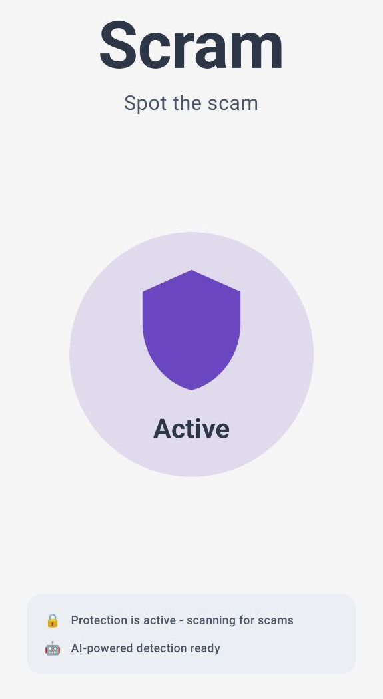

# 🛡️ Scram - AI-Powered Scam Detection

**"Spot the scam"** - Offline AI protection for WhatsApp, Gmail, SMS and more

  

*Enterprise-grade scam detection that works completely offline and keeps your data private*

## 🚀 **What is Scram?**

Scram uses advanced AI to detect scams in real-time by analyzing screenshots of your phone screen. It works **completely offline** using a 3.1GB Gemma-3n AI model that runs directly on your device - no internet required, no data shared.

### **Key Features**
- 🧠 **Advanced AI**: Gemma-3n model with multilingual scam detection
- 🔒 **100% Private**: All processing happens on your device, nothing sent to servers
- 📱 **Smart Detection**: Knows the difference between WhatsApp, Gmail, SMS for better accuracy
- 🌍 **Works Everywhere**: No internet needed after setup, works offline anywhere
- ⚡ **Instant Results**: 1-3 second analysis with clear warnings

## 🎯 **How It Works**

1. **Activate Protection**: Tap the shield in the app to start background monitoring
2. **Scan Suspicious Content**: Tap "Scan" in the notification when you see something suspicious  
3. **Get Instant Results**: AI analyzes the screenshot and warns you about scams
4. **Stay Protected**: Continuous protection while the service runs

### **What It Detects**
- ✅ Phishing emails pretending to be banks or tech companies
- ✅ Fake emergency messages asking for money
- ✅ Suspicious verification code requests
- ✅ Cryptocurrency and investment scams
- ✅ Romance scams and social engineering
- ✅ Fake delivery notifications and account warnings

## 📥 **Quick Start**

### **Requirements**
- Android 7.0 or higher
- 4GB free storage (for AI model)
- 2GB RAM recommended

### **Installation**
1. **Download & Install**: Get the APK and install on your device
2. **Download AI Model**: App will download the 3.1GB Gemma model (one-time, WiFi recommended)
3. **Grant Permissions**: Allow notifications and screen capture when prompted
4. **Activate Protection**: Tap the shield circle to start monitoring

### **First Use**
- The AI model download takes 5-15 minutes depending on your connection
- Once downloaded, everything works offline
- Tap "Scan" in the notification to check suspicious content
- Get instant scam detection results with explanations

## 🔍 **Smart Detection Features**

### **App-Aware Analysis**
- **WhatsApp/SMS**: Detects fake emergency requests and OTP phishing
- **Gmail/Email**: Identifies phishing attempts and credential theft
- **General Apps**: Comprehensive scam detection for any application

### **Multilingual Support**
- Automatically detects text in 15+ languages
- Understands cultural context and region-specific scam tactics
- No need to manually select languages

### **Privacy-First Design**
- Screenshots are analyzed locally and immediately deleted
- No data ever leaves your device
- Works completely offline after initial setup
- No accounts, no cloud services, no tracking

## ⚙️ **Technical Highlights**

- **AI Model**: Google Gemma-3n (3.1GB) with advanced multilingual capabilities
- **OCR Engine**: Google ML Kit for accurate text extraction
- **GPU Acceleration**: Automatic hardware optimization
- **Memory Efficient**: Smart resource management for stable operation
- **Battery Friendly**: Only processes when you tap "Scan"

For detailed technical information, see [TECHNICAL.md](TECHNICAL.md)

## 🛡️ **Privacy & Security**

### **Complete Offline Operation**
- All AI processing happens on your device
- No internet connection required after model download
- Screenshots are analyzed and immediately deleted
- Zero data transmission to any servers

### **Permissions Explained**
- **Screen Capture**: Takes screenshots when you tap "Scan"
- **Notifications**: Shows scam detection results
- **Usage Stats** (Optional): Improves detection by knowing which app you're using

## 🆘 **Troubleshooting**

### **Common Issues**
- **"AI model not loaded"**: Ensure 4GB free space and restart the app
- **"No text found"**: Make sure the screenshot contains readable text
- **High memory usage**: Normal when AI model is loaded (automatically cleaned up when not in use)

### **Best Practices**
- Use on WiFi for initial model download
- Ensure sufficient free storage (4GB+)
- Take clear screenshots with good lighting for best OCR results

## 📄 **License**

This project is licensed under the MIT License - see [LICENSE](LICENSE) for details.

---

**Real-World Impact**: Scram democratizes advanced cybersecurity by providing enterprise-grade scam detection to everyone, regardless of internet connectivity or economic status. Perfect for elderly users, remote areas, and privacy-conscious individuals.

**Disclaimer**: While Scram provides advanced AI-powered scam detection, always verify suspicious communications through official channels. No AI system is 100% accurate.
